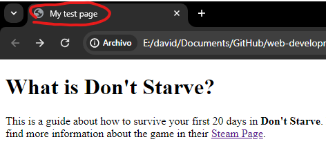

# General Elements

This section covers the most general and used structural elements of the HTML language.

## DOCTYPE

This element determines the rules for **rendering** the HTML language. It is used usually at the beggining of any `html` file as follows:

```html
<!DOCTYPE html>
```

## HTML

This element wraps all the content on the page. It is known as the root element:

```html
<html lang="en-US">
```

## Head

The head of an HTML document is the part that is not displayed in the web browser when the page is loaded. It contains information such as the page `<title>`, links to CSS (if you choose to style your HTML content with CSS), links to custom favicons, and other metadata (data about the HTML, such as the author, and important keywords that describe the document).

```html
<head>
    <meta charset="utf-8" />
    <title>My test page</title>
</head>
```

## Title

Contains the page title showed in the browser tab:

<p align='center'>
    
</p>

Markdown syntax is as follows:

```html
<title>My test page</title>
```

## Body

This contains all the content that displays on the page, including text, images, videos, games, playable audio tracks, or whatever else.

```html
<body>
    <h1>Content</h1>
</body>
```

# Common Tags

## h1

Used for define a document title.

```html
<h1>Doc title</h1>
```

## p

Used for define a paragraph.

```html
<p>Paragraph</p>
```

## img

Used for embed an image in the document content. There are 4 important properties for embedding images:

* **src**: link or local path to image
* **alt**: image title or description
* **height**: image height in pixels
* **width**: image width in pixels

```html

```

## anchor

Used for embed links in the document content. The `href` property is used in this tag to save the final URL.

```html
<a href="https://www.example.com">Text with Redirection</a>
```
Anchor can also be used to reference internal links just by specifying the .html file location path.

```html
<a href="s1/s2/text-start.html">Additional information</a>
```
We can use the anchor tag to set up links for downloading files of any type. Just adding the file location path and the `download` property to the tag.

```html
<a href="files/DST-promotions.xlsx" download="DST-promotions.xlsx">Excel File</a>
```

Finally, we can use anchor with the `mailto:` URL scheme to set a link that forwards to an email format ready to be sent.

```html
<a href="mailto:fr0xonem1@gmail.com">contact email</a>
```

## span

Used for applying css or javascript to a specific element without giving any extra meaning.

```html
<span style="font-size: 32px; margin: 21px 0; display: block;">
  Is this a top level heading?
</span>
```
## ul

The `ul` tag is used to create unordered lists, items inside lists should go with the `li` tag.

```html
<h2>Shopping List<h2>
<ul>
    <li>Meat</li>
    <li>Vegetables</li>
    <li>Fish</li>
    <li>Drinks</li>
    <li>Fruits</li>
</ul>
```
## ol

Is the same as `ul`, but the `ol` tag is used to create ordered lists. items inside lists should go with the `li` tag.

```html
<h2>Meeting Agenda<h2>
<ol>
    <li>Welcoming</li>
    <li>Introduction</li>
    <li>Onboarding</li>
    <li>Questions and Answers</li>
    <li>Conclusions</li>
</ol>
```
# Structure Tags

## header
Represents a group of introductory content. If it's child of `<body>` it defines the global header of a webpage, but if it's child of an article or section it defines the header for that specific section.

## nav
Contains the main navigation functionality for the page.

## main
Main Content, this tag is used for content unique to the page. Use main once per page and put it directly inside body.

### article
Encloses a block related content that makes sense on its own.

### section
Is similar to article, but is used to enclose a single piece of functionality (e.g. minimap, set of articles headlines).

## aside
Side Bar, used normally for related content and links.

## footer
Group of end content for a page.

# Non-semantic wrappers

Are used to enclose or group elements that cannot be represented by other tags. We can use these wrappers to apply CSS and javascript to a group of elements as a single entity.

## span

Is an **In-line** non semantic element. We use the `class` attribute to tag and reference the span tag.
```html
<span class="game_item">Shovel</span>
```

# Text Formatting

## strong

The `strong` tag is used to give text **bold** formatting, used as follows.

```html
<p>This is really <strong>hard!</strong></p>
```

## em

The `em` property is used to emphasize text and give it *Italics* format.

```html
<p>The most challenging task in life is <em>beat yourself</em></p>
```

## mark

The `mark` tag is used to <mark>highlight</mark> text.

```html
<p>The <mark>meat</mark> is the most delicious plate<p>
```

## blockquote

The `blockquote` tag is used to set up a block quotation. This tag has the `cite` parameter in which we can add the URL or reference for the quotation.

```html
<blockquote
    cite="https://dontstarve.fandom.com/wiki/Wilson/Quotes">
    <p>
        "I'm one heck of a scientist"
        <cite>-Wilson</cite>
    </p>
</blockquote>
```

## code and pre

`pre` and `code` tags are used often simultaneously to format code blocks maintaining the original text format of the source. Are used to show snippets of code.

```html
<pre>
    <code>
    from typing import List
    
    list = [1,4,3,4,5,4,1,3,4,5,6,7,4]

    def remove4(list: List[int]) -> bool:
        modified = False

        for num in list:
            if num == 4:
                list.remove(num)
                modified = True
        
        return modified

    remove4(list)
    </code>
</pre>
```

# Entity References

| Literal Character  | Reference |
| :----------------: | :-------: |
| <                  | `&lt;`    |
| >                  | `&gt;`    |
| "                  | `&quot;`  |
| '                  | `&apos;`  |
| &                  | `&amp;`   |

# Important Links

* [Introduction to HTML](https://developer.mozilla.org/en-US/docs/Learn/HTML/Introduction_to_HTML)
* [Google's WebMaster Tool](https://search.google.com/search-console/about?hl=en)