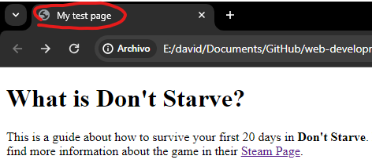

## DOCTYPE

This element determines the rules for **rendering** the HTML language. It is used usually at the beggining of any `html` file as follows:

```html
<!DOCTYPE html>
```

## HTML

This element wraps all the content on the page. It is known as the root element:

```html
<html lang='en-US'>
```

## Head

The head of an HTML document is the part that is not displayed in the web browser when the page is loaded. It contains information such as the page `<title>`, links to CSS (if you choose to style your HTML content with CSS), links to custom favicons, and other metadata (data about the HTML, such as the author, and important keywords that describe the document).

```html
<head>
    <meta charset="utf-8" />
    <title>My test page</title>
</head>
```

## Title

Contains the page title showed in the browser tab:

<p align='center'>
    
</p>

```html
<head>
    <meta charset="utf-8" />
    <title>My test page</title>
</head>
```